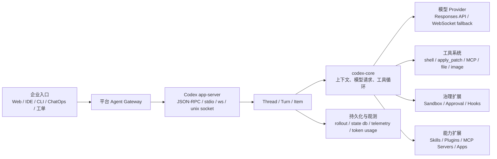

# Codex 企业级 Agent 平台二次开发指南

版本：2026-06-09  
源码位置：`D:\dev\github\codex`  
仓库：`https://github.com/openai/codex.git`  
当前 HEAD：`0526cb56ac3501a02968010d03873993c319e290`

> 说明：本指南基于本机克隆的 OpenAI 官方 `openai/codex` 源码、仓库内文档与 Python SDK 文档编写。官方 Codex 手册 `https://developers.openai.com/codex/codex-manual.md` 在本环境拉取时返回 HTTP 403，因此本文以当前源码为准，并对实验性/未稳定接口作保守标注。

## 目录

1. Codex 源码架构与二次开发边界
2. 企业级 Agent 平台接入架构
3. Python SDK 使用与平台封装示例
4. 插件开发：manifest、marketplace、MCP 与应用入口
5. 技能开发：SKILL.md、资源组织与触发机制
6. Hooks 与治理：审批、安全、审计和自动化拦截

---

## 第 1 章 Codex 源码架构与二次开发边界

### 1.1 仓库结构

本仓库是 Codex CLI / App Server / SDK 的开源主体，主要目录如下：

```text
codex/
  README.md
  docs/                         # 安装、配置、sandbox、exec、skills 等公开文档入口
  codex-cli/                    # npm 包装与分发脚本
  codex-rs/                     # Rust 主体，包含 CLI、TUI、core、app-server、plugin、hooks
  sdk/python/                   # openai-codex Python SDK
  sdk/typescript/               # TypeScript SDK
  sdk/python-runtime/           # Python SDK 依赖的 Codex runtime 包
```

关键源码位置：

```text
codex-rs/app-server/README.md
codex-rs/app-server-protocol/src/protocol/
codex-rs/core/src/
codex-rs/config/src/hook_config.rs
codex-rs/hooks/src/
codex-rs/core-plugins/src/
codex-rs/plugin/src/
codex-rs/core-skills/src/
codex-rs/skills/src/
sdk/python/src/openai_codex/
sdk/python/docs/
```

### 1.2 运行时主链路

Codex 的二次开发核心不建议直接改模型调用，而应围绕 `app-server`、SDK、插件、技能、hook、MCP 等扩展面做平台化封装。



### 1.3 核心模块职责

| 模块 | 职责 | 二次开发建议 |
|---|---|---|
| `codex-rs/app-server` | 对外 JSON-RPC 服务，驱动富客户端 | 企业入口优先接这一层，避免直接耦合 TUI |
| `codex-rs/app-server-protocol` | RPC 参数、响应、通知 schema | 前后端 SDK、网关协议生成的依据 |
| `codex-rs/core` | agent 主循环、上下文、模型请求、工具调用、sandbox | 不建议随意改；企业策略优先在外围拦截 |
| `codex-rs/config` | 配置层、hook 配置、requirements | 企业策略、托管配置、权限约束入口 |
| `codex-rs/hooks` | lifecycle hook discovery、执行、输出解析 | 安全拦截、审计、上下文注入的关键点 |
| `codex-rs/core-plugins` | marketplace、插件安装/读取/卸载 | 插件市场、团队插件分发入口 |
| `codex-rs/core-skills` | 技能加载、渲染、注入、触发 | 领域工作流固化入口 |
| `sdk/python` | Python 封装，启动 app-server 并走 JSON-RPC | 后端编排、批任务、多用户封装首选 |

### 1.4 Thread / Turn / Item

`codex app-server` 暴露三个基本原语：

- `Thread`：一段可持久化的 Codex 会话。
- `Turn`：用户发起的一轮任务，包含模型输出和工具调用。
- `Item`：turn 内的结构化内容，例如用户消息、agent 消息、shell 命令、文件变更、hook 提示等。

企业平台应保存 `threadId`、`turnId`、用户、租户、项目、审批记录、产物路径和 trace，而不是只保存最终文本。

---

## 第 2 章 企业级 Agent 平台接入架构

### 2.1 推荐接入方式

企业平台可以直接接 `codex app-server`，也可以通过 Python SDK 间接接入：

```text
方案 A：自建网关直接接 app-server JSON-RPC
  企业前端/后端 -> app-server stdio/ws/unix socket -> Codex runtime

方案 B：企业后端使用 Python SDK
  企业后端 -> openai-codex SDK -> app-server stdio -> Codex runtime
```

如果需要快速落地，多数企业场景优先使用方案 B；如果要开发 IDE、桌面端、长连接事件 UI，方案 A 更灵活。

### 2.2 app-server 协议要点

源码文档显示 `codex app-server` 支持：

- JSON-RPC 2.0 风格消息，wire 上省略 `"jsonrpc":"2.0"`。
- `stdio://`：默认，JSONL，一行一个消息。
- `ws://IP:PORT`：实验性/不支持生产依赖。
- `unix://`：本地控制面 socket。
- `GET /readyz` 与 `GET /healthz` 健康检查。
- 入口队列有背压，饱和时返回 JSON-RPC 错误 `-32001`，消息为 `Server overloaded; retry later.`。

初始化示例：

```json
{
  "method": "initialize",
  "id": 1,
  "params": {
    "clientInfo": {
      "name": "enterprise_agent_platform",
      "title": "Enterprise Agent Platform",
      "version": "0.1.0"
    },
    "capabilities": {
      "experimentalApi": true,
      "optOutNotificationMethods": []
    }
  }
}
```

生产建议：

- 每个企业服务实例维护 app-server worker 池。
- 入口层对 `Server overloaded` 做指数退避与队列降级。
- 所有客户端必须带稳定 `clientInfo.name/title/version`。
- 企业用途需要考虑合规日志身份标识，不要把所有流量伪装成默认 SDK 客户端。

### 2.3 线程和 turn 调用流程

```json
{
  "method": "thread/start",
  "id": 10,
  "params": {
    "cwd": "D:\\dev\\github\\my-project",
    "model": "gpt-5.1-codex",
    "sandbox": "workspaceWrite",
    "approvalPolicy": "onRequest",
    "personality": "pragmatic",
    "serviceName": "enterprise_agent_platform"
  }
}
```

```json
{
  "method": "turn/start",
  "id": 11,
  "params": {
    "threadId": "thr_123",
    "input": [
      {
        "type": "text",
        "text": "分析本仓库架构并提出二次开发建议。"
      }
    ],
    "sandboxPolicy": {
      "type": "readOnly"
    }
  }
}
```

调用后平台应持续读取通知：

```text
thread/started
turn/started
item/started
item/agentMessage/delta
item/completed
thread/tokenUsage/updated
hook/started
hook/completed
turn/completed
```

### 2.4 企业平台控制面

建议平台自己维护这些表：

```text
tenant(id, name, policy)
user(id, tenant_id, roles)
project(id, tenant_id, repo_url, default_cwd, permissions_profile)
agent_thread(id, codex_thread_id, project_id, user_id, status)
agent_turn(id, codex_turn_id, thread_id, task_type, status, started_at, completed_at)
approval(id, turn_id, action_type, payload_hash, approver, decision, reason)
artifact(id, turn_id, type, path, checksum)
audit_event(id, turn_id, event_type, payload, created_at)
```

这样可以把 Codex 的会话能力和企业自己的权限、审计、成本、SLA 分离。

---

## 第 3 章 Python SDK 使用与平台封装示例

### 3.1 SDK 定位

`openai-codex` Python SDK 是 Codex 工作流 SDK。它会：

1. 定位或使用配置中的 Codex binary。
2. 启动 `codex app-server --listen stdio://`。
3. 通过 typed JSON-RPC 调用 app-server。
4. 提供同步 `Codex` 和异步 `AsyncCodex`。

安装：

```bash
pip install openai-codex
```

开发仓库内调试：

```bash
cd D:\dev\github\codex\sdk\python
uv sync --extra dev
```

### 3.2 基础调用

```python
from openai_codex import ApprovalMode, Codex, Sandbox

with Codex() as codex:
    thread = codex.thread_start(
        cwd=r"D:\dev\github\my-project",
        sandbox=Sandbox.workspace_write,
        approval_mode=ApprovalMode.auto_review,
        model="gpt-5.1-codex",
        developer_instructions=(
            "你是企业平台中的研发 Agent。输出必须包含变更摘要、风险和验证命令。"
        ),
    )

    result = thread.run(
        "阅读仓库并生成模块架构说明。",
        sandbox=Sandbox.read_only,
    )

    print(result.status)
    print(result.final_response)
    print(result.usage)
```

公开枚举：

```python
ApprovalMode.auto_review  # on-request + auto reviewer
ApprovalMode.deny_all     # never approve escalated permission requests

Sandbox.read_only
Sandbox.workspace_write
Sandbox.full_access
```

企业默认建议：

- 代码阅读、问答：`Sandbox.read_only`
- 代码修改：`Sandbox.workspace_write`
- 生产系统、密钥、外部提交：不要默认 `full_access`

### 3.3 流式事件

```python
from openai_codex import Codex

with Codex() as codex:
    thread = codex.thread_start(cwd=r"D:\dev\github\my-project")
    turn = thread.turn("解释本次 diff 的风险。")

    for event in turn.stream():
        if event.method == "item/agentMessage/delta":
            print(event.payload.delta, end="", flush=True)
        elif event.method == "turn/completed":
            print("\ncompleted:", event.payload.turn.status.value)
```

平台封装时，建议把 event 转成自己的 SSE/WebSocket 事件：

```json
{
  "taskId": "task_001",
  "codexThreadId": "thr_123",
  "codexTurnId": "turn_456",
  "event": "item/agentMessage/delta",
  "payload": {}
}
```

### 3.4 steering 与 interrupt

```python
from openai_codex import Codex

with Codex() as codex:
    thread = codex.thread_start()
    turn = thread.turn("列出 200 个测试点。")

    # 用户中途介入，缩小输出范围
    turn.steer("只保留最关键的 10 个。")

    for event in turn.stream():
        if event.method == "turn/completed":
            print(event.payload.turn.status.value)
```

取消执行：

```python
with Codex() as codex:
    thread = codex.thread_start()
    turn = thread.turn("执行一次较长分析。")
    turn.interrupt()
    result = turn.run()
    print(result.status)
```

企业平台映射：

| 用户动作 | SDK 方法 | 平台状态 |
|---|---|---|
| 追加约束 | `turn.steer(...)` | `running -> running` |
| 停止任务 | `turn.interrupt()` | `running -> canceling -> interrupted` |
| 继续会话 | `thread.run(...)` | 新 turn |
| 恢复历史 | `codex.thread_resume(thread_id)` | `loaded/resumed` |

### 3.5 并发执行

Python SDK 文档说明一个客户端可以按 turn ID 路由多个活跃 turn 的 stream。企业实现仍建议把并发边界放在平台调度层。

```python
import asyncio
from openai_codex import AsyncCodex, Sandbox

TASKS = [
    (r"D:\dev\github\service-a", "生成架构摘要"),
    (r"D:\dev\github\service-b", "检查测试策略"),
    (r"D:\dev\github\service-c", "找出发布风险"),
]

async def run_one(codex: AsyncCodex, cwd: str, prompt: str) -> str:
    thread = await codex.thread_start(cwd=cwd, sandbox=Sandbox.read_only)
    result = await thread.run(prompt)
    return result.final_response or ""

async def main() -> None:
    async with AsyncCodex() as codex:
        results = await asyncio.gather(
            *(run_one(codex, cwd, prompt) for cwd, prompt in TASKS)
        )
        for item in results:
            print(item[:300])

asyncio.run(main())
```

生产建议：

- 单个 `AsyncCodex` 可承载多个 turn，但平台仍要限制租户并发。
- 每个任务绑定独立 `cwd` 和 sandbox。
- 对高成本任务设置超时和取消。
- 对 `ServerBusyError` 使用 `retry_on_overload` 或平台级退避。

### 3.6 结构化输出

```python
import json
from openai_codex import Codex
from openai_codex.types import Personality, ReasoningSummary

OUTPUT_SCHEMA = {
    "type": "object",
    "properties": {
        "summary": {"type": "string"},
        "risks": {"type": "array", "items": {"type": "string"}},
        "nextActions": {"type": "array", "items": {"type": "string"}}
    },
    "required": ["summary", "risks", "nextActions"],
    "additionalProperties": False,
}

with Codex() as codex:
    thread = codex.thread_start()
    result = thread.run(
        "评估把 Codex 接入企业 Agent 平台的上线风险。",
        output_schema=OUTPUT_SCHEMA,
        personality=Personality.pragmatic,
        summary=ReasoningSummary.model_validate("concise"),
    )

    payload = json.loads(result.final_response or "{}")
    print(payload["summary"])
```

结构化输出适合任务摘要、风险列表、工单字段、审批 payload。

### 3.7 SkillInput 与 MentionInput

```python
from openai_codex import Codex, SkillInput, TextInput

with Codex() as codex:
    thread = codex.thread_start()
    result = thread.run([
        SkillInput(
            name="enterprise-release-review",
            path=r"D:\dev\codex-skills\enterprise-release-review\SKILL.md",
        ),
        TextInput("使用该技能审查当前仓库发布风险。"),
    ])
    print(result.final_response)
```

这适合企业平台在特定场景强制注入一个审核技能。

---

## 第 4 章 插件开发：manifest、marketplace、MCP 与应用入口

### 4.1 插件是什么

插件是可安装的能力包，可包含：

- `skills/`：一组技能。
- `.mcp.json`：MCP server 配置。
- `.app.json`：应用/连接器声明。
- `assets/`：图标、截图、模板。
- `.codex-plugin/plugin.json`：插件 manifest。
- marketplace entry：让 Codex UI 能发现、安装、展示插件。

源码中 `core-plugins` 负责 marketplace、安装、读取、远程 bundle；`plugin` crate 提供共享 ID、摘要和 hook source 类型。

### 4.2 推荐目录

```text
enterprise-review-plugin/
  .codex-plugin/
    plugin.json
  skills/
    enterprise-release-review/
      SKILL.md
      references/
        policy.md
      scripts/
        collect_ci_status.py
  .mcp.json
  .app.json
  assets/
    icon.png
    logo.png
```

### 4.3 plugin.json 示例

```json
{
  "name": "enterprise-review",
  "version": "0.1.0",
  "description": "Enterprise release review workflows for Codex.",
  "author": {
    "name": "Platform Team",
    "email": "platform@example.com",
    "url": "https://example.com"
  },
  "homepage": "https://example.com/codex/enterprise-review",
  "repository": "https://github.com/example/enterprise-review",
  "license": "Apache-2.0",
  "keywords": ["release", "review", "security"],
  "skills": "./skills/",
  "mcpServers": "./.mcp.json",
  "apps": "./.app.json",
  "interface": {
    "displayName": "Enterprise Review",
    "shortDescription": "Release and security review workflows",
    "longDescription": "Codex skills and MCP tools for enterprise release readiness checks.",
    "developerName": "Platform Team",
    "category": "Productivity",
    "capabilities": ["Read", "Write", "Interactive"],
    "websiteURL": "https://example.com",
    "privacyPolicyURL": "https://example.com/privacy",
    "termsOfServiceURL": "https://example.com/terms",
    "defaultPrompt": [
      "Review this release for production risk.",
      "Check whether this PR satisfies release policy.",
      "Generate a rollout checklist."
    ],
    "brandColor": "#128982",
    "composerIcon": "./assets/icon.png",
    "logo": "./assets/logo.png"
  }
}
```

注意事项：

- `name` 建议 kebab-case，与插件目录一致。
- `version` 使用 semver。
- 路径使用相对路径并以 `./` 开头。
- `defaultPrompt` 最多 3 条，每条不超过 128 字符。
- `mcpServers`、`apps` 只在文件真实存在时写入。
- 当前源码 `manifest.rs` 可解析 `hooks` 字段，但内置 `plugin-creator` scaffold 文档提示校验器会拒绝 unsupported manifest fields such as `hooks`。因此生产插件如需 bundled hooks，必须在目标 Codex 版本上用 `plugin/read` 与 `hooks/list` 验证；保守做法是先把 hooks 放在平台/项目配置层或托管 requirements 中。

### 4.4 marketplace.json 示例

个人 marketplace 默认位置：

```text
~/.agents/plugins/marketplace.json
```

团队/仓库 marketplace：

```text
<repo-root>/.agents/plugins/marketplace.json
```

示例：

```json
{
  "name": "enterprise-local",
  "interface": {
    "displayName": "Enterprise Local Plugins"
  },
  "plugins": [
    {
      "name": "enterprise-review",
      "source": {
        "source": "local",
        "path": "./plugins/enterprise-review"
      },
      "policy": {
        "installation": "AVAILABLE",
        "authentication": "ON_INSTALL"
      },
      "category": "Productivity"
    }
  ]
}
```

策略字段：

| 字段 | 可选值 | 建议 |
|---|---|---|
| `policy.installation` | `NOT_AVAILABLE` / `AVAILABLE` / `INSTALLED_BY_DEFAULT` | 内部试点用 `AVAILABLE` |
| `policy.authentication` | `ON_INSTALL` / `ON_USE` | 涉及外部系统授权时用 `ON_INSTALL` |
| `category` | 字符串 | 保持团队内分类一致 |

### 4.5 插件中的 MCP

`.mcp.json` 示例：

```json
{
  "mcpServers": {
    "release-risk": {
      "command": "python",
      "args": [
        "${PLUGIN_ROOT}/scripts/release_risk_mcp.py"
      ],
      "env": {
        "RELEASE_API_BASE": "https://release.example.com"
      }
    }
  }
}
```

企业建议：

- MCP server 不直接持有用户密钥；密钥由平台注入短期 token。
- 工具 schema 保持小而明确。
- 所有写操作设计幂等键。
- 对外部系统提交、发消息、建工单等动作交给审批流。

### 4.6 插件开发流程

```bash
# 使用内置 plugin-creator skill 的脚本时，默认会生成有效 scaffold
python scripts/create_basic_plugin.py enterprise-review --with-skills --with-mcp --with-assets

# 校验插件
python scripts/validate_plugin.py <plugin-path>
```

企业平台可以把插件发布流程做成：

1. 插件仓库 PR。
2. manifest 校验。
3. skills 校验。
4. MCP server smoke test。
5. 安全扫描。
6. marketplace 更新。
7. Codex 新线程试用。

---

## 第 5 章 技能开发：SKILL.md、资源组织与触发机制

### 5.1 技能是什么

Skill 是 Codex 的领域工作流扩展，适合沉淀：

- 专门流程：发布审核、故障复盘、数据库变更审查。
- 工具说明：如何调用内部 API、如何解析专有文件。
- 企业知识：规范、schema、合规要求。
- 可复用资源：脚本、模板、参考文档、图片资产。

源码显示系统技能会内嵌在二进制中，并安装到：

```text
CODEX_HOME/skills/.system
```

用户/团队技能通常放在：

```text
CODEX_HOME/skills/<skill-name>
```

app-server 还提供：

```text
skills/list
skills/extraRoots/set
skills/config/write
skills/changed
```

### 5.2 技能目录规范

```text
enterprise-release-review/
  SKILL.md                    # 必需
  agents/
    openai.yaml               # 推荐，UI 元数据
  scripts/
    collect_ci_status.py
  references/
    release_policy.md
    security_checklist.md
  assets/
    rollout-template.md
```

`SKILL.md` 必须包含 YAML frontmatter：

```markdown
---
name: enterprise-release-review
description: Review enterprise software releases for production readiness, security risk, rollback plan quality, CI evidence, and approval completeness. Use when Codex is asked to evaluate a release, PR, deployment plan, hotfix, rollback, or production change.
---

# Enterprise Release Review

## Workflow

1. Read the release request and identify target services.
2. Check CI status using `scripts/collect_ci_status.py` when a build id is available.
3. Read `references/release_policy.md` before judging production readiness.
4. Produce a concise decision: approve, approve with conditions, or block.

## Output

Return:

- decision
- blocking risks
- missing evidence
- rollback readiness
- required approvals
```

### 5.3 触发机制

技能加载采用 progressive disclosure：

1. `name + description` 常驻上下文。
2. 触发后才加载 `SKILL.md` 正文。
3. `references/`、`scripts/`、`assets/` 由 Codex 按需读取或执行。

触发方式：

```text
隐式：用户请求匹配 description
显式：用户写 $enterprise-release-review
SDK：SkillInput(name=..., path=...)
插件：plugin manifest 暴露 skills 路径
```

### 5.4 references 与 scripts 设计

`references/release_policy.md`：

```markdown
# Release Policy

## Mandatory Evidence

- Passing CI run for target commit.
- Owner approval.
- Rollback plan.
- Security review for auth, payments, user data, permissions, or logging changes.

## Block Conditions

- Production secret exposed.
- Database migration lacks rollback.
- Test failures are ignored without owner signoff.
```

`scripts/collect_ci_status.py`：

```python
import json
import sys

def main() -> None:
    build_id = sys.argv[1]
    # Replace with internal CI API call.
    print(json.dumps({
        "buildId": build_id,
        "status": "passed",
        "url": f"https://ci.example.com/builds/{build_id}",
    }))

if __name__ == "__main__":
    main()
```

设计原则：

- 易错、重复、确定性的操作放脚本。
- 长文档放 references，不要塞进 `SKILL.md`。
- `SKILL.md` 控制在 500 行以内。
- references 一层引用即可，不要多级追文档。
- scripts 必须可以单独运行并有错误输出。

### 5.5 通过 app-server 管理技能

列出技能：

```json
{
  "method": "skills/list",
  "id": 20,
  "params": {
    "cwds": ["D:\\dev\\github\\my-project"],
    "forceReload": true
  }
}
```

临时增加技能根：

```json
{
  "method": "skills/extraRoots/set",
  "id": 21,
  "params": {
    "extraRoots": ["D:\\dev\\codex-skills"]
  }
}
```

平台建议：

- 把团队技能仓库 checkout 到只读路径。
- 使用 `skills/extraRoots/set` 注入平台技能。
- 用户级技能、项目级技能、系统技能分开管理。
- 对技能更新做版本号和变更审查。

---

## 第 6 章 Hooks 与治理：审批、安全、审计和自动化拦截

### 6.1 Hook 适用场景

Hook 是生命周期拦截点，适合做：

- 危险工具调用拦截。
- 用户 prompt 策略检查。
- 权限请求自动 allow/deny。
- 工具调用后结果审计。
- 会话启动时注入上下文。
- 压缩前后保存审计摘要。

源码中 hook 事件包括：

```text
PreToolUse
PermissionRequest
PostToolUse
PreCompact
PostCompact
SessionStart
UserPromptSubmit
SubagentStart
SubagentStop
Stop
```

handler 类型定义包含：

```text
command
prompt
agent
```

但当前 discovery 代码会跳过 `prompt` 和 `agent` hook，并提示 “not supported yet”；生产可用路径应以 `command` hook 为主。

### 6.2 Hook 配置文件

JSON 形态，通常为 `.codex/hooks.json`：

```json
{
  "hooks": {
    "PreToolUse": [
      {
        "matcher": "^Bash$",
        "hooks": [
          {
            "type": "command",
            "command": "python .codex/hooks/pre_tool_use.py",
            "commandWindows": "python .codex\\hooks\\pre_tool_use.py",
            "timeout": 10,
            "statusMessage": "checking command policy"
          }
        ]
      }
    ]
  }
}
```

TOML 形态，可写在 `config.toml` 对应层：

```toml
[[PreToolUse]]
matcher = "^Bash$"

[[PreToolUse.hooks]]
type = "command"
command = "python .codex/hooks/pre_tool_use.py"
commandWindows = "python .codex\\hooks\\pre_tool_use.py"
timeout = 10
statusMessage = "checking command policy"
```

matcher 规则：

- 省略、空字符串或 `*`：匹配全部。
- `Bash`：精确匹配。
- `Edit|Write`：多候选精确匹配。
- `^Bash$`、`mcp__memory__.*`：正则匹配。
- `UserPromptSubmit` 和 `Stop` 事件目前忽略 matcher。

### 6.3 Command hook 输入输出

命令 hook 的执行方式：

- Codex 通过 shell 执行 `command`。
- 当前工作目录为 hook 触发时的 `cwd`。
- 输入 JSON 写入 hook 进程 stdin。
- stdout 需要输出 JSON，Codex 按事件 schema 解析。
- stderr 可用于诊断。
- 默认超时 600 秒，最小 1 秒。

通用输出字段：

```json
{
  "continue": true,
  "stopReason": "optional reason",
  "suppressOutput": false,
  "systemMessage": "optional system-level message"
}
```

常用 hook-specific 输出：

```json
{
  "hookSpecificOutput": {
    "hookEventName": "PreToolUse",
    "permissionDecision": "deny",
    "permissionDecisionReason": "Do not run production delete command."
  }
}
```

### 6.4 PreToolUse 示例：阻断危险 Bash

`.codex/hooks/pre_tool_use.py`：

```python
import json
import re
import sys

payload = json.load(sys.stdin)
tool_name = payload.get("tool_name")
tool_input = payload.get("tool_input") or {}
command = " ".join(tool_input.get("cmd") or tool_input.get("command") or [])

danger = bool(re.search(r"\b(rm\s+-rf|kubectl\s+delete|terraform\s+destroy)\b", command))

if tool_name == "Bash" and danger:
    print(json.dumps({
        "continue": True,
        "hookSpecificOutput": {
            "hookEventName": "PreToolUse",
            "permissionDecision": "deny",
            "permissionDecisionReason": "Blocked by enterprise command policy."
        }
    }))
else:
    print(json.dumps({
        "continue": True,
        "hookSpecificOutput": {
            "hookEventName": "PreToolUse",
            "permissionDecision": "allow"
        }
    }))
```

配置：

```toml
[[PreToolUse]]
matcher = "^Bash$"

[[PreToolUse.hooks]]
type = "command"
command = "python .codex/hooks/pre_tool_use.py"
commandWindows = "python .codex\\hooks\\pre_tool_use.py"
timeout = 5
statusMessage = "checking Bash command"
```

### 6.5 PermissionRequest 示例：按平台策略拒绝

```python
import json
import sys

payload = json.load(sys.stdin)
tool_name = payload.get("tool_name")
tool_input = payload.get("tool_input") or {}

deny = tool_name == "Bash" and "prod" in json.dumps(tool_input).lower()

print(json.dumps({
    "continue": True,
    "hookSpecificOutput": {
        "hookEventName": "PermissionRequest",
        "decision": {
            "behavior": "deny" if deny else "allow",
            "message": "Production access requires manual change ticket." if deny else None
        }
    }
}))
```

配置：

```toml
[[PermissionRequest]]
matcher = "^Bash$"

[[PermissionRequest.hooks]]
type = "command"
command = "python .codex/hooks/permission_request.py"
timeout = 5
```

### 6.6 PostToolUse 示例：向上下文追加审计提示

```python
import json
import sys

payload = json.load(sys.stdin)

print(json.dumps({
    "continue": True,
    "hookSpecificOutput": {
        "hookEventName": "PostToolUse",
        "additionalContext": (
            "Enterprise audit note: include command purpose, result, "
            "and whether follow-up verification is required."
        )
    }
}))
```

配置：

```toml
[[PostToolUse]]
matcher = "^Bash$"

[[PostToolUse.hooks]]
type = "command"
command = "python .codex/hooks/post_tool_use.py"
timeout = 5
```

### 6.7 管理层配置与锁定

仓库文档显示 `requirements.toml` 支持：

```toml
allow_managed_hooks_only = true
```

该配置只在 `requirements.toml` 支持，用于忽略用户、项目、会话 hook 配置，但仍允许 managed hooks。

企业建议：

- 普通用户 hook 默认需要 trust。
- 企业强制 hook 放入 managed requirements。
- 对敏感项目启用 `allow_managed_hooks_only = true`。
- hook 脚本放只读目录，并纳入版本审计。
- `hooks/list` 作为平台启动检查，确认 hook 是否启用、trusted、hash 是否变化。

### 6.8 hooks/list 校验

```json
{
  "method": "hooks/list",
  "id": 30,
  "params": {
    "cwds": ["D:\\dev\\github\\my-project"]
  }
}
```

返回的 `HookMetadata` 包含：

```text
key
eventName
handlerType
matcher
command
timeoutSec
statusMessage
sourcePath
source
pluginId
displayOrder
enabled
isManaged
currentHash
trustStatus
```

平台可在任务启动前检查：

- 必需 hook 是否存在。
- hook 是否 enabled。
- trustStatus 是否为 managed 或 trusted。
- currentHash 是否在企业允许列表。

---

## 落地建议

### 推荐 0-90 天路线

1. 第 0-2 周：确定 3 个高价值场景，例如代码审查、发布检查、故障复盘。
2. 第 3-6 周：用 Python SDK 封装 task/thread/turn/event，接入企业认证与审计。
3. 第 7-10 周：沉淀团队 skills 和只读 MCP 工具，接入 Git/CI/工单。
4. 第 11-13 周：上线 hooks、审批、并发调度、成本指标和安全基线。

### 推荐最小可行架构

```text
Enterprise API
  -> Task Orchestrator
  -> Worker Pool
  -> openai-codex Python SDK
  -> Codex app-server stdio
  -> Codex core runtime

Control Plane
  -> SSO / tenant / project / policy
  -> approval service
  -> artifact store
  -> audit log
  -> metrics and cost dashboard
```

### 不建议的做法

- 不要让 Web 用户直接连本地 app-server。
- 不要把生产密钥写进 prompt 或 skill。
- 不要默认 `Sandbox.full_access`。
- 不要让插件直接越权调用生产系统。
- 不要把 hook 当成唯一安全边界；hook 应和 RBAC、sandbox、MCP 工具权限、审批一起使用。
- 不要直接修改 `codex-core` 来做企业策略，除非已有清晰的上游贡献计划。

### 源码依据索引

```text
README.md
docs/config.md
docs/skills.md
codex-rs/Cargo.toml
codex-rs/app-server/README.md
codex-rs/app-server-protocol/src/protocol/common.rs
codex-rs/app-server-protocol/src/protocol/v2/thread.rs
codex-rs/app-server-protocol/src/protocol/v2/turn.rs
codex-rs/app-server-protocol/src/protocol/v2/plugin.rs
codex-rs/app-server-protocol/src/protocol/v2/hook.rs
codex-rs/config/src/hook_config.rs
codex-rs/config/src/hooks_tests.rs
codex-rs/hooks/src/lib.rs
codex-rs/hooks/src/engine/discovery.rs
codex-rs/hooks/src/engine/command_runner.rs
codex-rs/hooks/src/engine/output_parser.rs
codex-rs/core-plugins/src/manifest.rs
codex-rs/plugin/src/lib.rs
codex-rs/core-skills/src/lib.rs
codex-rs/skills/src/lib.rs
sdk/python/README.md
sdk/python/docs/getting-started.md
sdk/python/docs/api-reference.md
sdk/python/src/openai_codex/client.py
sdk/python/src/openai_codex/api.py
sdk/python/src/openai_codex/_inputs.py
sdk/python/src/openai_codex/_sandbox.py
sdk/python/src/openai_codex/_approval_mode.py
```

